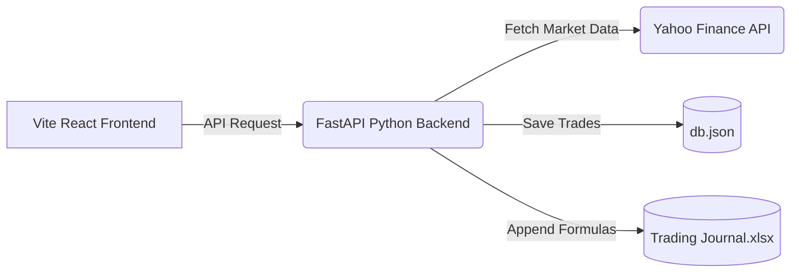
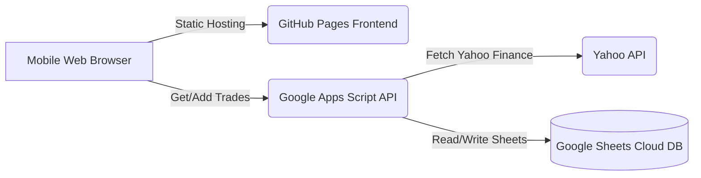
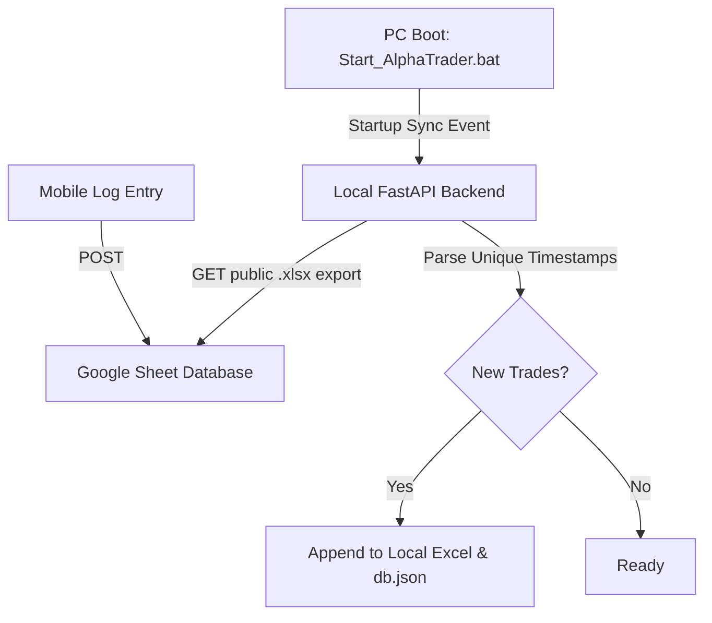

# 🗺️ AlphaTrader System Blueprint & Architecture Summary

This blueprint is designed for future developers and AI assistants to quickly understand the structure, data flows, and design patterns of AlphaTrader.

---

## 🚀 Project Overview
AlphaTrader is a personal trading journal application designed to log financial transactions, calculate real-time portfolio performance (using Yahoo Finance market prices), and synchronize data seamlessly. 

The system operates in **two dual modes** depending on where it is accessed:
1. **Local PC Mode:** React Frontend + FastAPI Backend syncing directly with a local `Trading Journal.xlsx` file and a `db.json` file.
2. **Serverless Cloud Mode:** React Frontend (on GitHub Pages) + Google Sheets Backend (running on Google Apps Script) allowing 24/7 mobile logging with the PC offline.

---

## 🏗️ System Architecture & Data Flow

### 1. Local PC Mode (Desktop)
* Runs when accessed via `localhost`, `127.0.0.1`, or Tailscale LAN IP.


### 2. Serverless Cloud Mode (Mobile Phone / PC-Offline)
* Runs when hosted on GitHub Pages. The frontend bypasses the FastAPI backend and queries the Google Apps Script Web App directly.


### 3. Synchronization Flow (PC-Cloud Merge)
* Keeps your offline mobile entries in sync with your local Excel sheet:


---

## 📂 File Directory Map

```
Trading Journal_pro/
│
├── .github/workflows/
│   └── deploy.yml              # GitHub Actions pipeline to compile & deploy frontend to GitHub Pages
│
├── backend/
│   ├── main.py                 # FastAPI Web API, yfinance fetcher, and Google Sheets sync engine
│   └── requirements.txt        # Python backend package dependencies
│
├── frontend/
│   ├── src/
│   │   ├── App.jsx             # React UI containing the Dashboard, Portfolio Analysis, and Settings panels
│   │   ├── App.css             # Main stylesheet customization
│   │   ├── index.css           # Global Tailwind/Aesthetic variable tokens
│   │   └── main.jsx            # React root mount point
│   │
│   ├── index.html              # Static HTML shell
│   ├── vite.config.js          # Vite assets configuration (set to base: './' for Pages compatibility)
│   └── package.json            # Node.js dependencies
│
├── db.json                     # Local JSON cache for trades and custom portfolio names
├── Trading Journal.xlsx        # Excel workbook (Single Source of Truth for desktop calculations)
├── Start_AlphaTrader.bat       # Desktop launcher batch script
├── .gitignore                  # Prevents private trade data (xlsx, db.json) from leaking to GitHub
├── system_blueprint.md         # This document
└── github_sheets_serverless_deployment_guide.md # Step-by-step setup guides
```

---

## 📊 Core Data Schema & Models

### 1. Trade JSON Object Schema
Both backend and frontend exchange the following JSON representation of a trade transaction:

```typescript
interface Trade {
  id: string;          // String representation of integer ID (e.g. "1")
  date: string;        // Transaction date format: YYYY-MM-DD (e.g. "2026-06-19")
  portfolio: string;   // Target portfolio label (e.g. "Main Trading", "Crypto")
  assetName: string;   // Asset symbol (e.g. "BJC", "MSTR", "BTC")
  assetType: string;   // Category (e.g. "Thai Stock", "Global Stock", "Crypto")
  currency: string;    // Base currency for entry (e.g. "THB", "USD")
  action: string;      // Action Type: "Buy" | "Sell"
  quantity: number;    // Count of units traded
  priceUnit: number;   // Unit cost in target currency
  why: string;         // Strategic reason / signal (e.g. "CDC Action Zone")
  remark: string;      // Optional comments or notes
}
```

### 2. Google Sheet Column Layout (Excel Integration)
Excel sheets and Google sheets must match this layout exactly:
* **Col 1 (A):** `Timestamp` (Auto-injected by Google Forms / script)
* **Col 2 (B):** `Date`
* **Col 3 (C):** `Asset Name`
* **Col 4 (D):** `Asset Type`
* **Col 5 (E):** `Currency`
* **Col 6 (F):** `Action`
* **Col 7 (G):** `Quantity`
* **Col 8 (H):** `Price/Unit`
* **Col 9 (I):** `Why (Decision Reason)`
* **Col 10 (J):** `Remark`

---

## 🔧 Dynamic API Host Resolver (Frontend)
To achieve dual local/cloud execution without rebuilding code, the frontend dynamically maps endpoints:

```javascript
// Located in frontend/src/App.jsx
const isCloudMode = !window.location.hostname.match(/^(localhost|127.0.0.1|100\.\d+\.\d+\.\d+)$/) && window.location.hostname !== "";

const getApiUrl = (endpoint) => {
  const scriptUrl = localStorage.getItem('google_apps_script_url');
  const useCloud = isCloudMode || !window.location.hostname;
  
  if (useCloud && scriptUrl) {
    return { type: 'cloud', url: scriptUrl }; // Routes directly to Google Sheets Apps Script
  }
  return { type: 'local', url: `${API_BASE}${endpoint}` }; // Routes to local FastAPI Backend
};
```

---

## 🔒 Security Best Practices
1. **Keep Private Data Offline:** The root `.gitignore` excludes `db.json`, `Trading Journal.xlsx`, and `*.xlsx` files. The repository on GitHub only contains the execution logic, rendering it safe even if pushed to public repositories.
2. **Secure App Settings:** The Cloud URL parameters (Google Apps Script endpoint) are stored inside the browser's `LocalStorage` on the client side. No config files or secrets are compiled inside the build artifacts.
3. **Google Sheets Security:** Link sheets as "Anyone with link can view" (Read-only) to let the app retrieve historical prices, while write operations are channeled through the Apps Script Web App `doPost` handler.
