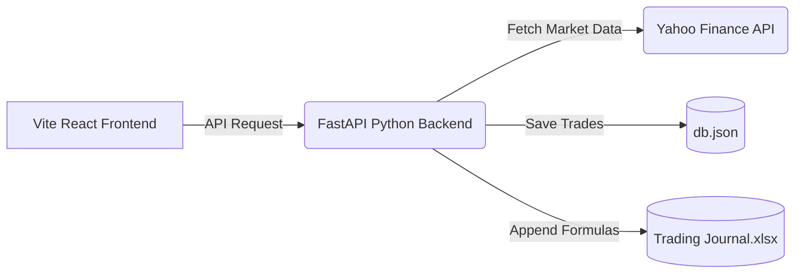
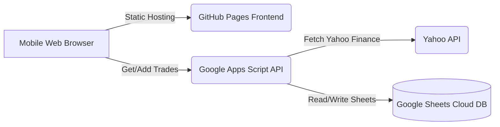
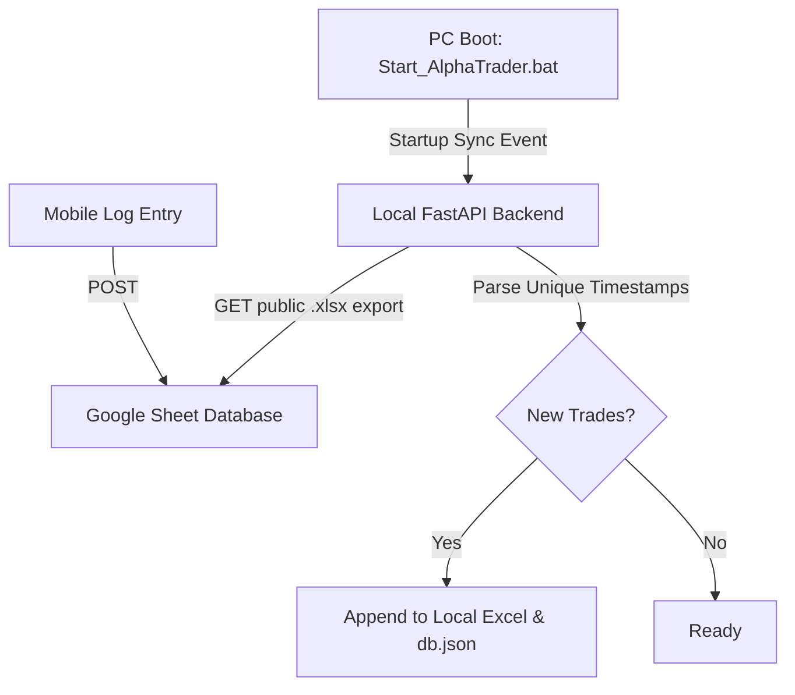

# 🗺️ AlphaTrader System Blueprint & Architecture Summary

This blueprint is designed for future developers and AI assistants to quickly understand the structure, data flows, and design patterns of AlphaTrader.

---

## 🚀 Project Overview
AlphaTrader is a personal trading journal application designed to log financial transactions, calculate real-time portfolio performance (using Yahoo Finance market prices), and synchronize data seamlessly. 

The system operates in **two dual modes** depending on where it is accessed:
1. **Local PC Mode:** React Frontend + FastAPI Backend syncing directly with a local `Trading Journal.xlsx` file and a `db.json` file.
2. **Serverless Cloud Mode:** React Frontend (on GitHub Pages) + Google Sheets Backend (running on Google Apps Script) allowing 24/7 mobile logging with the PC offline.

---

## 🏗️ System Architecture & Data Flow

### 1. Local PC Mode (Desktop)
* Runs when accessed via `localhost`, `127.0.0.1`, or Tailscale LAN IP.


### 2. Serverless Cloud Mode (Mobile Phone / PC-Offline)
* Runs when hosted on GitHub Pages. The frontend bypasses the FastAPI backend and queries the Google Apps Script Web App directly.


### 3. Synchronization Flow (PC-Cloud Merge)
* Keeps your offline mobile entries in sync with your local Excel sheet:


---

## 📂 File Directory Map

```
Trading Journal_pro/
│
├── .github/workflows/
│   └── deploy.yml              # GitHub Actions pipeline to compile & deploy frontend to GitHub Pages
│
├── backend/
│   ├── main.py                 # FastAPI Web API, yfinance fetcher, and Google Sheets sync engine
│   └── requirements.txt        # Python backend package dependencies
│
├── frontend/
│   ├── src/
│   │   ├── App.jsx             # React UI containing the Dashboard, Portfolio Analysis, and Settings panels
│   │   ├── App.css             # Main stylesheet customization
│   │   ├── index.css           # Global Tailwind/Aesthetic variable tokens
│   │   └── main.jsx            # React root mount point
│   │
│   ├── index.html              # Static HTML shell
│   ├── vite.config.js          # Vite assets configuration (set to base: './' for Pages compatibility)
│   └── package.json            # Node.js dependencies
│
├── db.json                     # Local JSON cache for trades and custom portfolio names
├── Trading Journal.xlsx        # Excel workbook (Single Source of Truth for desktop calculations)
├── Start_AlphaTrader.bat       # Desktop launcher batch script
├── .gitignore                  # Prevents private trade data (xlsx, db.json) from leaking to GitHub
├── system_blueprint.md         # This document
└── github_sheets_serverless_deployment_guide.md # Step-by-step setup guides
```

---

## 📊 Core Data Schema & Models

### 1. Trade JSON Object Schema
Both backend and frontend exchange the following JSON representation of a trade transaction:

```typescript
interface Trade {
  id: string;          // String representation of integer ID (e.g. "1")
  date: string;        // Transaction date format: YYYY-MM-DD (e.g. "2026-06-19")
  portfolio: string;   // Target portfolio label (e.g. "Main Trading", "Crypto")
  assetName: string;   // Asset symbol (e.g. "BJC", "MSTR", "BTC")
  assetType: string;   // Category (e.g. "Thai Stock", "Global Stock", "Crypto")
  currency: string;    // Base currency for entry (e.g. "THB", "USD")
  action: string;      // Action Type: "Buy" | "Sell"
  quantity: number;    // Count of units traded
  priceUnit: number;   // Unit cost in target currency
  why: string;         // Strategic reason / signal (e.g. "CDC Action Zone")
  remark: string;      // Optional comments or notes
}
```

### 2. Google Sheet Column Layout (Excel Integration)
Excel sheets and Google sheets must match this layout exactly:
* **Col 1 (A):** `Timestamp` (Auto-injected by Google Forms / script)
* **Col 2 (B):** `Date`
* **Col 3 (C):** `Asset Name`
* **Col 4 (D):** `Asset Type`
* **Col 5 (E):** `Currency`
* **Col 6 (F):** `Action`
* **Col 7 (G):** `Quantity`
* **Col 8 (H):** `Price/Unit`
* **Col 9 (I):** `Why (Decision Reason)`
* **Col 10 (J):** `Remark`

---

## 🔧 Dynamic API Host Resolver (Frontend)
To achieve dual local/cloud execution without rebuilding code, the frontend dynamically maps endpoints:

```javascript
// Located in frontend/src/App.jsx
const isCloudMode = !window.location.hostname.match(/^(localhost|127.0.0.1|100\.\d+\.\d+\.\d+)$/) && window.location.hostname !== "";

const getApiUrl = (endpoint) => {
  const scriptUrl = localStorage.getItem('google_apps_script_url');
  const useCloud = isCloudMode || !window.location.hostname;
  
  if (useCloud && scriptUrl) {
    return { type: 'cloud', url: scriptUrl }; // Routes directly to Google Sheets Apps Script
  }
  return { type: 'local', url: `${API_BASE}${endpoint}` }; // Routes to local FastAPI Backend
};
```

---

## 🔒 Security Best Practices
1. **Keep Private Data Offline:** The root `.gitignore` excludes `db.json`, `Trading Journal.xlsx`, and `*.xlsx` files. The repository on GitHub only contains the execution logic, rendering it safe even if pushed to public repositories.
2. **Secure App Settings:** The Cloud URL parameters (Google Apps Script endpoint) are stored inside the browser's `LocalStorage` on the client side. No config files or secrets are compiled inside the build artifacts.
3. **Google Sheets Security:** Link sheets as "Anyone with link can view" (Read-only) to let the app retrieve historical prices, while write operations are channeled through the Apps Script Web App `doPost` handler.

---

## 🔄 Sync Engine & CORS Fallback Architecture

### 1. Duplication Prevention (Local Backend)
* **Signature-Based Deduplication**: When syncing local trades with Google Sheets, transactions are matched by a composite signature (`Date|Asset|Action|Quantity|PriceUnit`). This prevents double logging if the user clicks sync multiple times.
* **Startup Deduplication Manager**: A startup handler (`deduplicate_local_db`) runs automatically on FastAPI launch, cleaning up duplicates in `db.json` and rewriting `Trading Journal.xlsx` cleanly.

### 2. Cloud Mode Data Fetch Strategy (Frontend — `fetchData`)
The frontend uses a **two-step read strategy** in Cloud Mode to guarantee data loads on all browsers including mobile Safari and Brave:

| Step | Source | Purpose | CORS Safe? |
|------|--------|---------|------------|
| **Step 1 (Primary)** | `gviz/tq?tqx=out:csv` Google Sheet CSV | Load all trades & build portfolio | ✅ Always |
| **Step 2 (Best-effort)** | Google Apps Script `?action=getData` | Fetch live Yahoo Finance prices & exchange rates | ⚠️ May fail on mobile |

```
fetchData() in Cloud Mode:
  ├── fetchDirectFromGoogleSheet(sheetId)   ← ALWAYS runs first (guaranteed CORS)
  │     └── gviz/tq CSV → parseCSV() → setTrades() → setPortfolios()
  │     └── open.er-api.com → setLiveRates()          ← rates fallback
  └── callGoogleAppsScript(?action=getData)  ← best-effort for live prices only
        ├── success → setLivePrices(), setLiveRates() ← overrides CSV rates
        └── failure → silent warn, WAC used as price fallback
```

* **Why CSV first?** The `gviz/tq` endpoint is served with `Access-Control-Allow-Origin: *` and never issues a cross-origin redirect. Apps Script redirects `script.google.com → script.googleusercontent.com`, which many mobile browsers block silently under strict tracking protection.
* **Apps Script for writes only**: `addTrade` and `deleteTrade` still use `callGoogleAppsScript` via POST with `Content-Type: text/plain` (bypasses CORS preflight OPTIONS).
* **Client-Side CSV Parser**: An RFC 4180-compliant parser (`parseCSV`) handles nested quotes, commas inside values, CRLF line endings, and maps columns by fuzzy keyword matching (e.g., `"price/unit"`, `"price_unit"`, `"price unit"` all resolve to `priceUnit`).
* **Exchange Rate Fallback**: If Apps Script is blocked, `open.er-api.com/v6/latest/USD` (CORS-enabled, free tier) is called to retrieve `USD→THB` and `EUR→THB` rates.

### 3. `getApiUrl` Resolver Logic
```javascript
const getApiUrl = (endpoint) => {
  const useCloud = isCloudMode || !window.location.hostname;
  if (useCloud) {
    return { type: 'cloud', url: localStorage.getItem('google_apps_script_url') || '' };
    // Always returns 'cloud' on GitHub Pages — even if Apps Script URL not set yet,
    // because the CSV read path only needs the Sheet ID, not the script URL.
  }
  return { type: 'local', url: `${API_BASE}${endpoint}` };
};
```

### 4. Onboarding Guard Logic
The initial setup screen (`AlphaTrader Cloud`) is shown only when **both** the Google Sheet ID **and** the Apps Script URL are absent from `localStorage`. If the Sheet ID alone is present (saved from a prior session), the main app mounts and loads trades immediately via the CSV path without waiting for the Apps Script URL.

```javascript
// App.jsx — early return condition
// isConnected is initialised ONCE from localStorage — stable, not affected by typing
const [isConnected, setIsConnected] = useState(() => !!localStorage.getItem('google_sheet_id'));

// Guard uses isConnected, not the live React typing states
if (isCloudMode && !isConnected) {
  return <OnboardingScreen />;
}
// On Connect click: save to localStorage first, then call setIsConnected(true)
// The state change triggers re-render into the main app; useEffect auto-calls fetchData()
```

---

## 🐛 Bug Fix Log

### [2026-06-19] — Fix: Zero Balance on Mobile / GitHub Pages

**Symptom:** Opening `https://sirapop-top.github.io/trading-journal-pro/` on mobile showed zero balance and no trades, while `http://localhost:5173/` on PC showed all 10 transactions correctly.

**Root Causes Identified:**

1. **`getApiUrl` returned `type: 'local'` if Apps Script URL was missing** — Even in Cloud Mode on GitHub Pages, if `localStorage` had no script URL, `getApiUrl` fell through to `type: 'local'`, causing `axios.get('')` against a non-existent local server → empty trades → zero balance.

2. **Apps Script CORS redirect silently blocked on mobile** — `fetch(scriptUrl, { redirect: 'follow' })` follows the `script.google.com → script.googleusercontent.com` redirect, but mobile Safari/Brave block this cross-origin redirect under tracking protection, returning an opaque/failed response before the catch block even runs.

3. **Onboarding guard too strict** — `if (isCloudMode && !googleAppsScriptUrl)` blocked the entire app even if only the Apps Script URL was missing. A user with just the Sheet ID stored could not load any data.

**Fix Applied (`frontend/src/App.jsx`):**
- `getApiUrl`: Changed to always return `type: 'cloud'` when `isCloudMode` is true, regardless of whether the Apps Script URL is set.
- `fetchData` (Cloud Mode): Restructured to use **CSV as the mandatory primary source** for all trade data. Apps Script is only called afterwards in a non-blocking best-effort block to retrieve live prices.
- Onboarding guard: Changed from `!googleAppsScriptUrl` to `!googleSheetId && !googleAppsScriptUrl` so the app loads when at least the Sheet ID is present.

**Commit:** `ed4a569` — `Fix zero balance bug: use CORS-safe CSV as primary data source in cloud mode`

---

### [2026-06-19] — Fix: Typing in Setup Screen Causes Premature Redirect to Dashboard

**Symptom:** On the AlphaTrader Cloud setup screen, as soon as the user started typing the Google Sheet ID, the app immediately jumped to the dashboard and displayed a **"Cloud Sync Connection Blocked"** error popup, even before clicking the Connect button.

**Root Cause:**

The onboarding guard condition used React **typing state** (`googleSheetId`) instead of a stable **localStorage-backed flag**:

```javascript
// BROKEN — googleSheetId is a live React state that changes on every keystroke
if (isCloudMode && !googleSheetId && !googleAppsScriptUrl) {
  return <OnboardingScreen />;
}
// User types one character → !googleSheetId becomes false
// → guard exits → main app mounts → useEffect fires fetchData()
// → localStorage still empty → "Cloud Sync Connection Blocked" error
```

**Fix Applied (`frontend/src/App.jsx`):**

Introduced a dedicated `isConnected` state that is initialised **once** from `localStorage` and only changes when the user explicitly clicks **"Connect Journal"**. Typing never affects it.

```javascript
// FIXED — isConnected only changes when user clicks Connect, not while typing
const [isConnected, setIsConnected] = useState(
  () => !!localStorage.getItem('google_sheet_id')  // reads localStorage once on mount
);

if (isCloudMode && !isConnected) {
  return <OnboardingScreen />;
}

// On Connect click:
localStorage.setItem('google_sheet_id', googleSheetId.trim());  // save first
setIsConnected(true);   // triggers re-render into main app; useEffect auto-calls fetchData()
```

Additional improvements in the same fix:
- **Apps Script URL made optional** on the setup screen — only the Sheet ID is required to read trades. The Script URL is only needed to write new trades from mobile.
- **Info text updated** to clearly explain: Sheet ID = read access, Apps Script URL = write access.

**Commit:** `52dc942` — `Fix onboarding guard: use isConnected state (localStorage) not typing state to prevent premature dashboard redirect`

---

### [2026-06-19] — Fix: Deleting a Trade Removes the Wrong Row

**Symptom:** On the mobile app (Cloud Mode), deleting a trade removed a completely different trade from the Google Sheet. For example, trying to delete CPALL (added 19 Jun 2026) instead deleted MSTR (4 Jun 2026) and ROJNA (29 May 2026). The newly added trade (CPALL) could not be deleted at all.

**Root Cause — Off-by-1 ID Mismatch:**

Trade IDs are assigned as the data-row loop index `i` (starting at 1), but `deleteTrade` passes that value directly to `sheet.deleteRow()`, which expects the **actual spreadsheet row number** (header occupies row 1, so data starts at row 2):

```
Sheet Layout:
  Row 1  → Header (Timestamp, Date, Asset Name, ...)
  Row 2  → Trade 1 (BJC)
  Row 3  → Trade 2 (KCE)
  ...
  Row 12 → Trade 11 (CPALL — newly added)

OLD (broken) ID assignment in getDashboardData:
  i = 1 → id = "1"   (but actual sheet row = 2)
  i = 11 → id = "11" (but actual sheet row = 12)

OLD deleteTrade("11"):
  sheet.deleteRow(11) → deletes sheet row 11 = MSTR, NOT CPALL ❌

OLD deleteTrade("1"):
  sheet.deleteRow(1) → deletes the HEADER ROW ❌
```

**Fix Applied:**

Changed the ID scheme so that **ID = actual spreadsheet row number** across all three locations:

| Location | Old | New |
|---|---|---|
| `fetchDirectFromGoogleSheet` (App.jsx) | `id: i.toString()` | `id: (i + 1).toString()` |
| `getDashboardData` (Apps Script) | `id: i.toString()` | `id: (i + 1).toString()` |
| `deleteTrade` guard (Apps Script) | `rowIdx > 0` | `rowIdx > 1` (never delete header row 1) |

```javascript
// FIXED — getDashboardData (Apps Script & CSV parser):
// i starts at 1 (loop skips header), so sheet row = i + 1
id: (i + 1).toString()
// BJC at i=1 → id="2" = actual sheet row 2 ✅

// FIXED — deleteTrade (Apps Script):
// ID now IS the sheet row number, pass directly to deleteRow()
function deleteTrade(tradeId) {
  var rowIdx = parseInt(tradeId);  // e.g. "12" → 12
  if (rowIdx > 1 && rowIdx <= sheet.getLastRow()) {
    sheet.deleteRow(rowIdx);       // deletes correct row ✅
  }
}
```

**Files Changed:**
- `frontend/src/App.jsx` — `fetchDirectFromGoogleSheet`: `id: i.toString()` → `id: (i + 1).toString()`
- `github_sheets_serverless_deployment_guide.md` — Apps Script `getDashboardData` and `deleteTrade` functions updated

> [!IMPORTANT]
> The Apps Script code inside Google's cloud editor must also be updated manually by the user (copy from `github_sheets_serverless_deployment_guide.md` → paste into [script.google.com](https://script.google.com) → Save → Re-deploy). The frontend fix alone is not enough for delete to work correctly.

**Commit:** `8bc94df` — `Fix delete wrong trade bug: ID now equals actual sheet row number, fixes off-by-1 in deleteTrade`

---

### [2026-06-19] — Fix: Onboarding Watermarks & Portfolio Management / Transfers in Cloud Mode

**Symptom:**
1. Confusing example strings displayed as hardcoded input placeholders (watermarks) in Google Sheet ID and Apps Script URL fields on the onboarding screen.
2. Clicking "Transfer" to move an asset to another portfolio on mobile (Cloud Mode) resulted in a "Failed to transfer position" error popup.

**Root Causes:**
1. Watermark placeholders were hardcoded directly in onboarding inputs: `placeholder="e.g. 1kUYZcvNnbw..."`.
2. Portfolio CRUD operations (`handleTransferPosition`, `handleDeletePortfolio`, `handleRenamePortfolio`) made raw `axios.put`/`axios.delete` requests to the local FastAPI backend. Since Cloud Mode (GitHub Pages hosting) has no running FastAPI backend server, these calls failed with Network/CORS errors.

**Fixes Applied (`frontend/src/App.jsx`):**
1. **Watermarks Removed:** Cleared all hardcoded examples from Google Sheet ID and Apps Script URL inputs (`placeholder=""`) on both the Onboarding Setup Screen and the Settings panel.
2. **Cloud Mode Portfolio Operations Routing:**
   - **`handleTransferPosition`:** In Cloud Mode, saves custom asset-to-portfolio assignments directly in `localStorage` under `alphatrader_portfolio_mappings`.
   - **`handleAddPortfolio`:** Saves custom portfolio names in `localStorage` (`alphatrader_custom_portfolios`) so empty portfolios persist across page refreshes.
   - **`handleDeletePortfolio` / `handleRenamePortfolio`:** In Cloud Mode, checks for active trades (to match backend guards) and updates or clears custom mappings in `localStorage`.
3. **CSV Parsing Integration:** Updated `fetchDirectFromGoogleSheet` to load custom empty portfolios from `localStorage` and override the derived `portfolio` for each asset using the saved `alphatrader_portfolio_mappings`.

**Files Changed:**
- `frontend/src/App.jsx`

**Commit:** `e75fa92` — `Fix: remove setup screen watermarks and enable cloud mode portfolio transfers/management`

---

### [2026-06-19] — Feature: Persistent Cloud Portfolio Configuration Stored on Google Sheets

**Symptom / Request:**
Storing custom portfolio mappings and custom portfolio lists client-side in browser `localStorage` can overload memory on mobile over time and fails to synchronize portfolio changes across multiple devices accessing the same journal.

**Fixes Applied:**
1. **Google Sheets Config Sheet:**
   - Apps Script automatically creates and reads a secondary sheet tab named **`Portfolios`** with headers `Asset Name`, `Portfolio`, and `Portfolio Names`.
   - Incoming requests (`addPortfolio`, `deletePortfolio`, `renamePortfolio`, `transferPosition`) write updates directly to this tab on Google Sheets.
2. **Guaranteed CORS Read Integration (`frontend/src/App.jsx`):**
   - The frontend's `fetchDirectFromGoogleSheet` function now queries the `Portfolios` sheet tab using a public CORS-safe CSV endpoint (`gviz/tq?sheet=Portfolios`).
   - Mappings and portfolios list are loaded dynamically on page mount, allowing all client devices to stay synchronized.
   - Values are cached in `localStorage` for fast offline loading and fallback.
3. **Deployment Documentation Updated:**
   - Updated **`github_sheets_serverless_deployment_guide.md`** with the new Apps Script code so the user can redeploy the script to script.google.com.

**Files Changed:**
- `frontend/src/App.jsx`
- `github_sheets_serverless_deployment_guide.md`
- `system_blueprint.md`

**Commit:** `0720d43` — `Fix: save portfolio mappings and custom portfolios to google sheets Portfolios tab`

---

### [2026-06-20] — Feature: Real-Time Ticker Verification, Strategy Editing, Secure Passcode Lock & Trader Performance Analytics

**Request / Issues Addressed:**
1. Invalid tickers could bypass verification and get written to the database (especially in Cloud Mode).
2. Users wanted a secure lock-out passcode to protect private trade history.
3. Users requested a feature to edit trade strategies after logging.
4. Users requested a detailed operational manual and improved performance insights.

**Fixes & Enhancements Applied:**
1. **Universal Ticker Verification:**
   - Proxied verification through Google Apps Script in Cloud Mode (`validateTicker` action).
   - Enforced validation inside the trade submission flow for both Local and Cloud modes.
   - Added a confirmation modal fallback if Yahoo Finance is unreachable (e.g., offline usage) to allow intentional bypass.
2. **Passcode Protection & Cooldown Lockout:**
   - Built a custom security panel in Settings to toggle passcode locks and select auto-lock on idle (1-30 minutes).
   - Designed a glassmorphic secure lock overlay preventing access to DOM/components.
   - Added a security cooldown that locks out keyboard entries for 60 seconds after 5 incorrect password attempts.
3. **Editable Trade Strategies:**
   - Implemented an "Edit Strategy" pencil action in the trade history logs table.
   - Added `PUT /api/trades/{trade_id}/strategy` endpoint in FastAPI and `updateTradeStrategy` in Apps Script to rewrite lines in Local Excel and Cloud Sheets.
4. **Trader Analytics KPI Grid:**
   - Computed win rate, profit factor, risk-to-reward ratio, average win/loss ratio, and maximum win/loss values and embedded them on both desktop and mobile dashboards.
5. **Comprehensive Operation Manual:**
   - Created `USER_MANUAL.md` mapping setup, cloud deployment steps, and core features.

**Files Changed:**
- `backend/main.py`
- `frontend/src/App.jsx`
- `github_sheets_serverless_deployment_guide.md`
- `system_blueprint.md`
- `USER_MANUAL.md` (new file)

**Commit:** `7071e62` — `Feature: added validation proxy, passcode lock screen, trade strategy editor, trader analytics card, and user manual`

---

### [2026-06-20] — Fix: Temporal Dead Zone JavaScript Crash causing Blank (Black) Screen

**Symptom:**
When loading the Trading Journal app in Cloud Mode or locally, the interface was completely blank (black screen). No errors were logged in the UI, but the browser console showed a `ReferenceError: Cannot access 'filteredTrades' before initialization`.

**Root Cause:**
In `frontend/src/App.jsx`, the `tradingAnalytics` useMemo hook was declared at line 273 and referenced `filteredTrades`. However, `filteredTrades` was declared much later in the file (around line 737). This caused a Temporal Dead Zone (TDZ) JavaScript crash, preventing the React component from mounting.

**Fixes Applied:**
1. Relocated the `tradingAnalytics` useMemo hook definition so it resides immediately after the `filteredTrades` hook declaration. This ensures `filteredTrades` is defined and initialized before it is referenced.
2. Rebuilt the production application bundle (`npm run build`).
3. Re-deployed the corrected build to the `gh-pages` branch on GitHub Pages.

**Files Changed:**
- `frontend/src/App.jsx`
- `system_blueprint.md`

**Commit:** `269284d` — `Fix Temporal Dead Zone ReferenceError by relocating tradingAnalytics hook`

---

### [2026-06-20] — Feature: Log Out Buttons, Custom Strategy Dropdown Items, and Transaction-Level Portfolio Transfers

**Request:**
1. Add a "Log Out" button to the onboarding setup page and settings panel to allow clearing cached connection keys.
2. Add an "Other" option to the strategy dropdown so users can define custom strategies during editing.
3. Migrate the portfolio transfer action from "Active Positions" to individual logged trade entries inside the "Trading Journal" log table.

**Fixes & Enhancements Applied:**
1. **Log Out Functionality:**
   - Appended a **"Clear Settings & Log Out"** button to the onboarding login panel and a **"Log Out / Disconnect"** button inside the Settings Cloud sync card.
   - Clears Google Sheet ID, Apps Script URL, and app security passcode from the browser's `localStorage` and resets connection states.
2. **Custom Strategy Entry:**
   - Modified the Edit Strategy modal select dropdown in `App.jsx` to include an `Other` item.
   - When selected, a conditional `Custom Strategy` text input is displayed allowing custom inputs (e.g. `RSI > 70`).
3. **Transaction-Level Portfolio Transfers:**
   - **Excel Schema Update:** Updated local Excel loader/writer in `backend/main.py` to support writing and reading from a dedicated `Portfolio` column (Column O / 15).
   - **Apps Script Sync Update:** Implemented `updateTradePortfolio` action to rewrite a specific trade's portfolio cell in Google Sheets. If the column header is missing, it dynamically adds the header column.
   - **Backend API Endpoints:** Added `PUT /api/trades/{trade_id}/transfer` route to FastAPI.
   - **Frontend UI Moves:** Removed the "Transfer" button from Active Positions grids and appended it to the actions column of each individual trade entry inside the main Trading Journal log table.

**Files Changed:**
- `backend/main.py`
- `frontend/src/App.jsx`
- `github_sheets_serverless_deployment_guide.md`
- `system_blueprint.md`

**Commit:** `0122240` — `Feature: added log out buttons, custom strategy dropdown, and trade-level transfers`

---

### [2026-06-20] — Fix: Crypto Ticker Verification & Mobile Responsive UI Layout Redesign

**Request:**
1. Fix ticker validation so that crypto assets (e.g. BTC, ETH) verify successfully on Yahoo Finance.
2. Redesign the mobile view to make it more user-friendly and fully functional.

**Fixes & Enhancements Applied:**
1. **Crypto Ticker Validation & Pricing Mapping:**
   - **Backend API:** Updated `get_ticker_symbol` in `backend/main.py` to check for `crypto` asset types and automatically append `-USD` to the symbol (e.g., `BTC` -> `BTC-USD`, `ETH` -> `ETH-USD`) if it doesn't already contain a dash.
   - **Apps Script Guide:** Updated the Google Apps Script `validateTicker` and `fetchPriceFromYahoo` functions in `github_sheets_serverless_deployment_guide.md` with the same suffix mapping to support seamless verification and live price queries in Cloud Mode.
2. **Mobile Layout & Usability Redesign:**
   - **Mobile Actions Column:** Embedded the newly created **Edit Strategy** and **Transfer Portfolio** buttons directly into the action footer of each trade card in the mobile log list feed. Mobile users now have full feature parity with desktop users for transaction modifications.
   - **Responsive Form Fields:** Redesigned the hardcoded column grids in the Log New Trade Modal (`Row` and `Col` elements) to use stacking responsive sizes (`xs={24} sm={12}`). On phone screens, input fields stack vertically for easy touch navigation.
   - **Header Overflow Protection:** Abbreviated the mobile header branding title to `AT` instead of `ALPHATRADER` on small screens. This frees up horizontal space and guarantees the portfolio, currency, eye censor, passcode, and sync buttons fit on one line on narrow screens without wrapping.

**Files Changed:**
- `backend/main.py`
- `frontend/src/App.jsx`
- `github_sheets_serverless_deployment_guide.md`
- `system_blueprint.md`

**Commit:** `92a5879` — `Fix: crypto ticker validation and responsive mobile layout updates`

---

### [2026-06-20] — Documentation: Crypto Ticker Mapping Instructions Added to SSOT List & Operation Guide

**Request:**
Add guidelines describing how to key in crypto asset names (symbols like BTC, ETH) for ticker verification in the Single Source of Truth (SSOT) data settings.

**Fixes & Enhancements Applied:**
1. **Frontend Settings Panel:** Added a new description bullet point under the "Single Source of Truth (SSOT) Ticker Mappings" card in the Settings tab (`App.jsx`) instructing the user to key in standard crypto symbols directly (e.g. `BTC`, `ETH`), and highlighting that the system handles mapping suffix suffixes (`-USD`) automatically.
2. **User Manual:** Updated the "Log New Trade" section of `USER_MANUAL.md` to describe the ticker input format rules for Thai Stocks (`.BK`), Global Stocks (direct), and Crypto Assets (`-USD` mapped automatically).

**Files Changed:**
- `frontend/src/App.jsx`
- `USER_MANUAL.md`
- `system_blueprint.md`

**Commit:** `b663b77` — `docs: add crypto ticker mapping guide to user manual and settings panel`

---

### [2026-06-20] — Fix: Crypto Ticker Suffix Verification Pre-mapping on Frontend

**Request:**
Fix a bug where typing `BTC` in the Asset Name with the category set to `Crypto` validates it as a Global Stock ETF on Yahoo Finance (due to collision with NYSE ClearShares Piton ETF ticker `BTC`) instead of Bitcoin (`BTC-USD`) when using the Google Sheets serverless cloud mode backend.

**Root Cause:**
While the FastAPI backend and updated Apps Script guide mapped `BTC` to `BTC-USD` on the server-side, a client might be running an older/un-updated Apps Script deployment. When the frontend sent the verification request, it passed `BTC` directly to Apps Script. Since Yahoo Finance has a legitimate Global Stock with ticker `BTC`, the Apps Script returned `valid: true`, bypassing the intended crypto check and saving it as `BTC` (ETF) instead of `BTC-USD` (Crypto).

**Fixes & Enhancements Applied:**
1. **Frontend Pre-mapping Suffix:** Added client-side mapping logic to `handleValidateTicker` and `handleAddTrade` in `frontend/src/App.jsx`. If the Asset Category is `Crypto` and the ticker symbol does not contain a dash (`-`), the app automatically appends `-USD` (e.g. `BTC` becomes `BTC-USD`) and updates the form input value *before* initiating verification or submitting the trade. This ensures correct verification against Yahoo Finance crypto tickers even if the deployed Google Sheets Apps Script has not been updated.
2. **Form Auto-Correction:** Updating the form fields dynamically gives direct visual feedback to the user, showing that the system has corrected `BTC` to `BTC-USD`.

**Files Changed:**
- `frontend/src/App.jsx`
- `system_blueprint.md`
